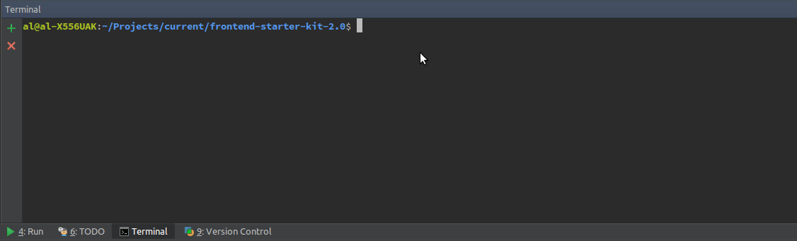

# Frontend starter kit 2.0

This starter kit was created for easier starts of projects. <br>
It has to shrink spending time for creating project.

For work with it you have to have stable "nodejs" version.

I would recommended "nodejs" 10.13 version.
For manipulations with "nodejs" versions you can use Node Version Manager (mnv).

If you wanna now how to install it, you can visit [this](https://nodejs.org/en/download/package-manager/#header-nvm) link

##Installation

Firstly, you have to install packages with helps command:
```
npm install
```

